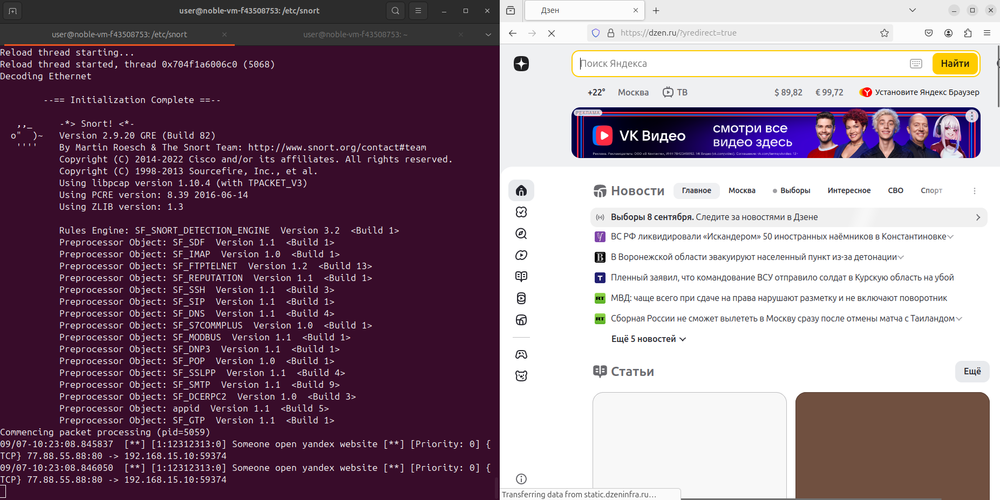
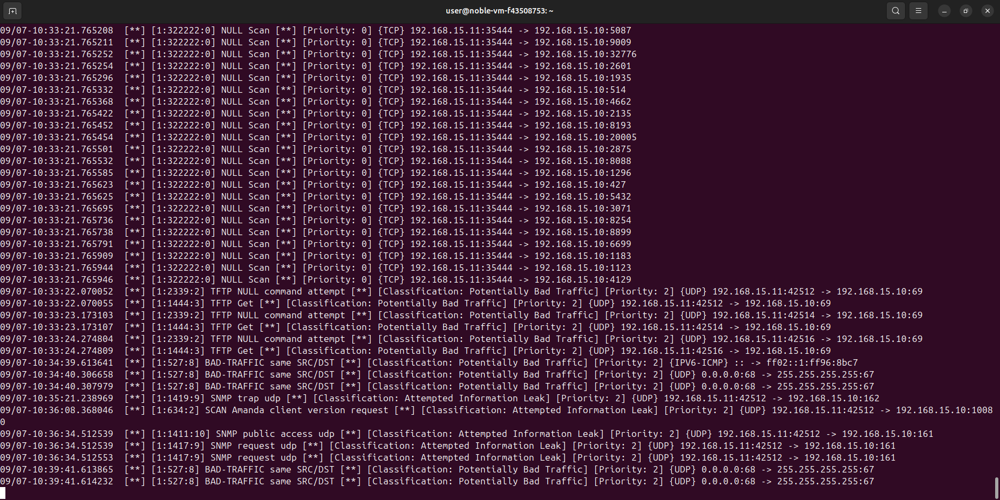
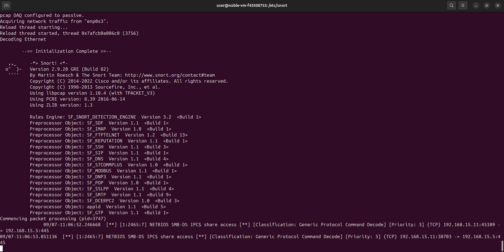

# Текст задания

Цель этого задания — получить сведения о том, как осуществляется защита с помощью систем обнаружения и предотвращения вторжений. В результате вы должны научиться пользоваться Snort.

Snort — свободная сетевая система предотвращения вторжений (IPS) и обнаружения вторжений (IDS) с открытым исходным кодом, способная выполнять регистрацию пакетов и в реальном времени анализировать трафик в IP-сетях.

Выполняет протоколирование, анализ, поиск по содержимому, а также широко используется для активного блокирования или пассивного обнаружения целого ряда нападений и зондирований, таких как атаки на переполнение буфера, скрытое сканирование портов, атаки на веб-приложения, SMB-зондирование и попытки определения операционной системы. Программное обеспечение в основном используется для предотвращения проникновения и блокирования атак, если они имеют место.

Snort использует правила, написанные простым , но в то же время гибким и достаточно мощным языком. Существует ряд общих принципов написания, запомнить которые достаточно просто.

Большая часть правил Snort умещается в 1 строку. Это следствие того, что до версии 1.8 нельзя было использовать многострочные записи. В более поздних версиях правила можно растягивать на несколько строк, вставляя в конец строки символ \ (без кавычек).

Правила Snort состоят из двух частей: заголовка правила и параметров правила. Заголовок содержит описание действия, протокол передачи данных, IP-адреса, сетевые маски, порты источника и назначения.

Параметры правила хранят предупреждающее сообщение, а также информацию о том, какую часть обнаруженного пакета нужно обработать в случае срабатывания правила.
Что нужно сделать

## Установка и запуск

- [x] Узнайте свой IP-адрес командой ifconfig
- [x] Установите Snort:

```bash
sudo apt update
sudo apt-get install -y snort
```

При установке нужно будет указать защищаемую сеть. Введите ..*.0/24 (Где ..* — первые три числа вашего IP-адреса)

- [x] Запустите Snort: `sudo service snort start`

## Настройка правил

- [x] Перейдите в каталог /etc/snort/rules: `cd /etc/snort/rules`
- [x] Создайте файл с правилами:

```bash
sudo vi test.rules
```

    alert tcp any any -> any any (content:"yandex.ru" ; msg:"Someone open yandex website" ; sid:12312313;)

- [x] Перейдите в каталог /etc/snort `cd /etc/snort`
- [x] Теперь нужно изменить содержимое конфигурационного файла Snort: `sudo vi snort.conf`
- [x] Найдите строчки с правилами: они начинаются с include $RULE_PATH, это в части Step 7. Добавьте файл с нашими правилами:

    include $RULE_PATH/test.rules

- [x] В файле `snort.conf` также укажите домашнюю сеть. В Step 1 измените строчку `ipvar HOME_NET any` на `ipvar HOME_NET 192.168.15.0/24`
- [x] Запустите Snort:

```bash
sudo snort -A console -i eth0 -c snort.conf
```

- [x] Зайдите на http://yandex.ru и проверьте в терминале, как работает правило.



## Проверка написанных правил

Теперь нам понадобится ещё одна виртуальная машина, на ней должен быть установлен Nmap.

- [x] Со второй ВМ используйте `ping`, посмотрите, как реагирует Snort.
- [x] Используйте различные методы сканирования Nmap: `-sS`, `-sT`, `-sN`, `-sU`, `-sX`, `-sF` — и посмотрите, как реагирует Snort.
- [x] В файл test.rules добавьте правило обнаружения сканирования Nmap -sN (NULL Scan):

```
alert tcp any any -> any any (msg:"NULL Scan"; flags: 0; sid:322222;)
```

- [x] Запустите Snort:

```bash
sudo snort -A console -i eth0 -c snort.conf
```

- [x] Со второй виртуальной машины произведите NULL-сканирование:

```bash
sudo nmap -sN
```

- [x] Проверьте, как работает правило.



> Можно загрузить обновленные правила Snort.
> Зарегистрируйтесь на сайте и скачайте последнюю версию правил (обращаем ваше внимание, что без VPN на сайт зайти не получится).
>  Разархивируйте скачанный архив и скопируйте каталоги rules, so_rules и preproc_rules в /etc/snort:

    sudo cp -R ./rules/ /etc/snort/
    sudo cp -R ./so_rules/ /etc/snort/
    sudo cp -R ./preproc_rules/ /etc/snort/

- [x] Далее нам потребуется виртуальная машина из модуля «Анализ защищённости и Red Team: подходы и утилиты». Введите её в ту же подсеть, что и Snort.
- [x] Попробуйте повторно выполнить задание с уязвимостью EternalBlue и посмотрите, что выдаст Snort.



## Условия реализации

### В форму для отправки задания приложите сделанные скриншоты:

- [x] уведомления при переходе на yandex.ru;
- [x] уведомления при NULL-сканировании;
- [x] уведомления при атаке EternalBlue.

### Критерии оценивания

Максимальное количество баллов — 5.

- [x] 5 — отправлены 3 скриншота.
- [ ] 4 — отправлены 2 скриншота.
- [ ] 3 — отправлен 1 скриншот.
- [ ] 0 — задача не решена.
